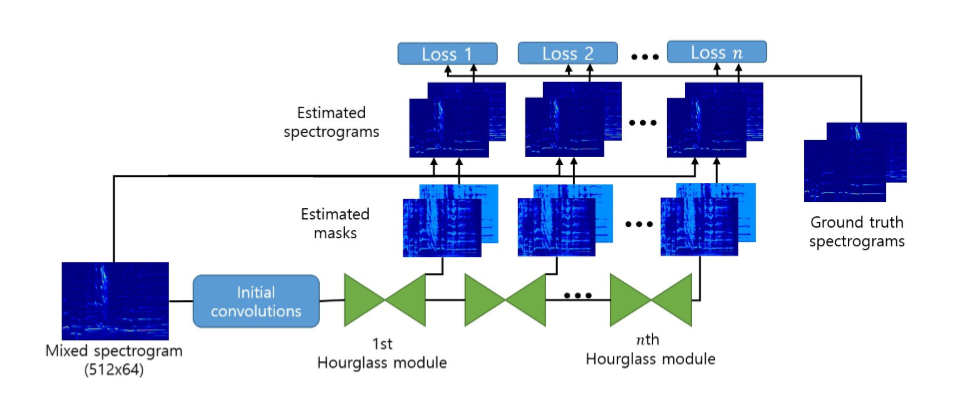
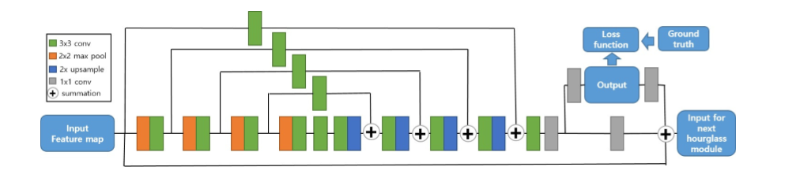

# 音频分析及处理——音乐人生分离器

# 实验报告

石耕源 2015013219 

冯玉彤 2015013202 

谢运帷 2015013185

---

## 1. 算法说明

### 1.1 人声分离网络

我们搭建的人声分离器系统，借鉴了作业要求中给出的参考论文[^1]。此篇文章指导我们完成了人声分离中的重要部分——由一个堆叠的 Hourglass 神经网络，将人声和背景音乐的特征从混合的音乐特征中分离出来，得到两幅与频谱图同样尺寸的 mask 矩阵。随后，我们进行 mask 矩阵的优化，得到人声和背景音乐两张频谱图特征。最后，我们依靠原音乐的频谱图的辐角信息，应用到人声和背景的频谱图上，还原出人声和背景音频。

上图展示了此篇文章的网络结构：首先，我们的输入是单通道的原音乐的频谱图 $X$（大小为1\*512\*64），经过一系列初始卷积层，提取出 feature map （256\*512\*64），输入到堆叠 Hourglass 模块中。每个 Hourglass 模块输出两个和输入频谱图相同大小的 mask 矩阵（2\*512\*64），分别对应人声和背景的 mask 的估计，原混合音乐的频谱图与 mask 矩阵对应层的乘积（对应元素相乘）即为整个网络预测的人声和背景的预测频谱图。与此同时， Hourglass 模块还会计算出一个和原输入（256\*512\*64）相同大小的 feature map ，输入到下一个 Hourglass 模块中。

文章中使用的 Hourglass 模块就如上图所示，它先通过池化和卷积核将 feature map 的分辨率降低，再通过上采样 (upsampling) 将特征还原到与输入相同的大小。整个过程借鉴了残差网络 (ResNet) 的设计思路，伴随着浅层信息直接和深层信息相加的过程，可以很好地保留原始的特征信息。最后通过 1\*1 卷积，将输出和下一层 Hourglass 输入的通道规范化。文中特别提到，网络中没有使用 batch normalization 等规范化操作，这是因为这些操作会让梯度值下降，让整体训练的过程变慢，从结果上来看也不会使准确率提升。

训练过程所需的 Loss 函数也自然而然地可以给出，即是根据所有 Hourglass 模块给出的 mask 矩阵得到的预测频谱图和目标频谱图之间的L1范数差异之和。
$$
\mathcal{J}=\sum_{i=1}^C \sum_{j=1}^D ||\mathbf{Y_i}-\mathbf{X} \odot \hat{\mathbf{M}}_{ij}||_{1,1}
$$
其中 $C$ 表示要分离的声音源的数目， $D$ 表示堆叠的 Hourglass 模块数， $\mathbf{Y}_i$ 表示第 $i$ 个声音源对应的真实频谱图矩阵， $\mathbf{X}$ 表示输入的混合频谱图矩阵， $\hat{\mathbf{M}}_{ij}$ 表示第 $j$ 个 Hourglass 模块输出的对应于第 $i$ 个声音源的 mask 矩阵， $\odot$ 运算表示矩阵同位置元素相乘。

即使在应用中，只有最后一个模块的预测才与最终的预测结果相关，这样的 Loss 函数还是可以加速训练过程，使网络快速的收敛。

实际实现基本遵循文中所提出的过程。网络的训练过程在多GPU的机器上进行。

### 1.2 输出 mask 矩阵优化

本部分基于论文[^2] 提出的 mask 矩阵优化方法，目的是对人声分离网络输出的 mask 进行优化，其主要方法是对输入的音乐频谱图进行非负矩阵分解 (NMF) 以提取特征，针对分离后的特征进行聚类，以达到对人声部分产生更突出且更平滑的输出 mask 。

NMF方法是传统方法的常用提取特征方法，在多篇论文[^2, 4-6] 中有所提及。给定频谱图 $X_{C \times M}$ 和特征数 $R$ ，将 $X$ 分解为component矩阵 $W_{C \times R}$ 和 activation 矩阵 $H_{R \times M}$ ，满足 $X=W \cdot H$ 。

原频谱图的第 $r$ 层特征( $r \in [1, R]$ ) 表示为矩阵 $X^{(r)}_{C \times M}$ ，其中 $X^{(r)}_{c, m} = W_{c,r} \cdot H_{r, m}$ 。如果认为频谱图矩阵中的每个元素都有一个“最突出的”源(本问题中为人声或背景音乐中的一个源)，则某个元素应该被划分的源由特征矩阵中在该位置的最大的元素决定，即构造矩阵 $F_{C \times M}$ ，满足
$$
F_{c, m} = \arg\max_{1 \leq r \leq R} X^{(r)}_{c, m}
$$

文中认为，若在 $F$ 矩阵中有若干相邻的元素属于同一特征层 $r$ ，则它们倾向于属于同一个声音源，因此 mask 矩阵的对应位置也应趋于一致。在实现中使用的是类型为浮点数的 mask 矩阵，因此优化后的矩阵将 mask 矩阵的每个元素取其原值与其所在的聚类的平均值二者中较大的。

### 1.3 音频重建

由于训练所用频谱图是取振幅频谱图，经 Hourglass 网络输出分离的频谱图已丢失辐角信息，质量较高的还原方法有[^8] 中的 WaveNet 网络。本实验采用[^1] 中的还原方法，即将 Hourglass 网络输出的频谱图与原混合音频的辐角复合，并经傅里叶反变换 (Inverse Short-time Fourier Transform) 还原成音频向量。经此方法重建的音频听觉上效果较好。

## 2. 实验结果

### 2.1 数据集

本实验应用了MIR-1K数据集[^6] ，其中包含1000首中文卡拉OK歌曲裁剪成的片段，采样频率为16kHz，每个片段的背景音乐与人声部分分别在左右声道中。

### 2.2 评测指标

本实验的结果测试参考了论文[^7] 提出的音频分离任务衡量指标，分别为 signal-to-distortion ratio (SDR), source-to-interference ratio (SIR), source-to-artifacts (SAR)，同时参考了论文[^3]提出的 Normalized SDR (NSDR)，其计算公式为：
$$
NSDR(\hat{v}, v, x) = SDR(\hat{v}, v) - SDR(x, v),
$$
其中$\hat{v}$ 表示模型分离出的音频信号，$v$ 表示真实的分离音频信号，$x$ 表示真实的混合音频信号。

通过对每段音频计算出其 NSDR, SIR, SAR 后，按照音频长度进行加权平均，得到最终的 GNSDR, GSIR, GSAR 作为评测指标。

### 2.3 测试结果

选取了测试集中的80首歌曲片段计算 GNSDR, SIR, SAR 值，实验结果如下：

| Source         | GNSDR | GSIR  | GSAR  |
| -------------- | ----- | ----- | ----- |
| Singing Voice  | 7.57  | 11.12 | 12.16 |
| Accompaniments | 7.26  | 9.97  | 13.28 |

由此可见基于 Hourglass 网络的方法优于传统方法的分离效果。此外，使用 mask 优化效果并无明显提升。

## 3. 使用说明

运行源代码根目录下 `separate_work.py` ，可以读取训练好的模型，并进行歌曲的分离，分别输出人声与背景音乐的 wav 文件。

该实验项目已托管于Github，地址 https://github.com/AlexsaseXie/Hourglass-voice-separate

## 4. 小组分工

石耕源：文献调研，mask 矩阵优化，实验测试

冯玉彤：Hourglass网络结构设计和修正，实验测试算法，小组展示

谢运帷：Hourglass网络主要设计、搭建、训练、验证

### 参考文献

[^1]: Park, Sungheon, et al. "Music Source Separation Using Stacked Hourglass Networks." *arXiv preprint arXiv:1805.08559* (2018).
[^2]: Zhang, Xiu, Wei Li, and Bilei Zhu. "Latent time-frequency component analysis: A novel pitch-based approach for singing voice separation." *Acoustics, Speech and Signal Processing (ICASSP), 2015 IEEE International Conference on*. IEEE, 2015.
[^3]: Alexey Ozerov, Pierrick Philippe, Frdric Bimbot, and Rmi Gribonval. Adaptation of bayesian models for single-channel source separation and its application to voice/music separation in popular songs. IEEE Trans- actions on Audio, Speech, and Language Processing, 15(5):1564–1578, 2007.
[^4]: Vembu, Shankar, and Stephan Baumann. "Separation of Vocals from Polyphonic Audio Recordings." *ISMIR*. 2005.
[^5]: De Cheveigné, Alain, and Hideki Kawahara. "YIN, a fundamental frequency estimator for speech and music." *The Journal of the Acoustical Society of America* 111.4 (2002): 1917-1930.
[^6]: Hsu, Chao-Ling, and Jyh-Shing Roger Jang. "On the improvement of singing voice separation for monaural recordings using the MIR-1K dataset." *IEEE Transactions on Audio, Speech, and Language Processing* 18.2 (2010): 310-319.
[^7]: E. Vincent, R. Gribonval, and C. Fe ́votte, “Performance measurement in blind audio source separation,” IEEE Transactions on Audio, Speech, and Language Process- ing, vol. 14, no. 4, pp. 1462–1469, 2006.

[^8]: Van Den Oord, Aäron, et al. "WaveNet: A generative model for raw audio." *SSW*. 2016.

